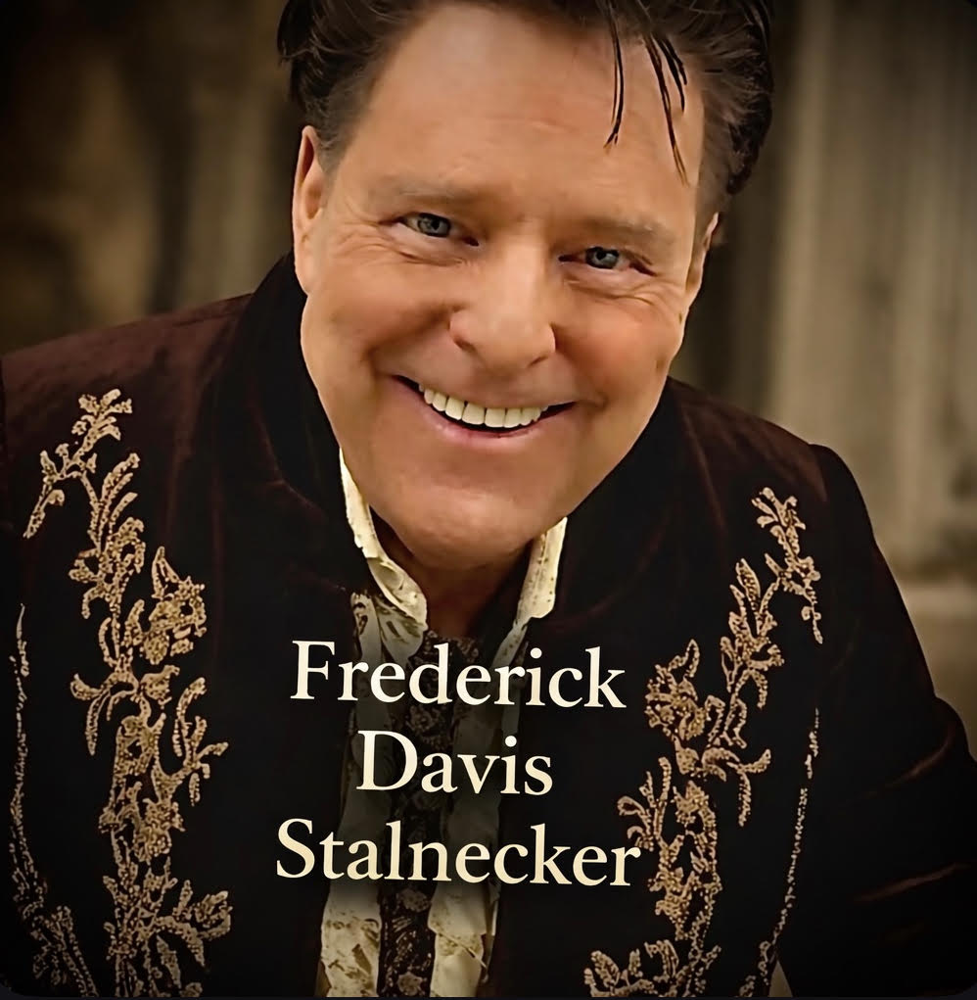

<p align="center">
  
</p>

# THEOS — Dual-Engine Dialectical Reasoning Framework

[](https://github.com/Frederick-Stalnecker/THEOS/actions/workflows/ci.yml)
[](#)
[](https://pypi.org/project/theos-reasoning/)
[](#)
[](LICENSE)
[](#)

**[→ The Vision](https://frederick-stalnecker.github.io/THEOS/vision) · [Documentation Site](https://frederick-stalnecker.github.io/THEOS/) · [API Reference](https://frederick-stalnecker.github.io/THEOS/api) · [Developer Guide](https://frederick-stalnecker.github.io/THEOS/guide) · [Current Status](https://frederick-stalnecker.github.io/THEOS/status) · [YouTube](https://www.youtube.com/@TheosAIGovernance)**

> *THEOS Certification · Medicine · Constitutional AI · Global Wisdom Network — [read the vision →](https://frederick-stalnecker.github.io/THEOS/vision)*

---

## The Result That Started This

Ask an AI: *"What is the difference between egotism and arrogance?"*

| Method | Answer |
|--------|--------|
| **Single-pass LLM** | "Egotism is internal, arrogance is external — a spectrum." |
| **THEOS (two engines, wringer)** | "They are orthogonal failures on different dimensions. Egotism distorts self-perception. Arrogance distorts other-perception. You can have one without the other — a self-deprecating bully, or a narcissist who is outwardly polite." |

The first answer is a line. The second is a 2×2 matrix. It explains something the first cannot: **why a humble person can still be contemptuous of others.**

This difference — the discovery of structure that a single reasoning pass misses — is what THEOS is built to produce.

---

## What THEOS Is

THEOS is a **dual-engine dialectical reasoning framework** written in pure Python (3.10+, zero external dependencies for core). It structures AI reasoning as a wringer: two opposed engines press against each other until their contradiction shrinks to a provable minimum or halts at irreducible disagreement.

```
              INDUCTION
           ↗            ↘
     (observation)    (pattern)
         ↑                ↓
    ┌────────────────────────────┐
    │  LEFT ENGINE (constructive)│ → D_L*
    │  private self-reflection   │
    │  pass 1 → pass 2           │
    └────────────────────────────┘
                  ↓ WRINGER ↓
    ┌────────────────────────────┐
    │  RIGHT ENGINE (adversarial)│ → D_R*
    │  private self-reflection   │
    │  pass 1 → pass 2           │
    └────────────────────────────┘
         ↓                ↑
      GOVERNOR        WISDOM
    (halts when Φ < ε) (accumulates)
```

**The three-step loop (I→A→D→I):**
1. **Induction** — encode observation, extract patterns
2. **Abduction** — each engine proposes its strongest hypothesis (left: constructive, right: adversarial)
3. **Deduction** — each engine derives conclusions from its own hypothesis

Each engine runs a **private self-reflection**: its first-pass deduction feeds back into its own induction for a second inner pass — before the wringer measures contradiction between engines. This is not shared feedback. It is each engine reasoning about what it just concluded.

**The key insight:** circular reasoning creates a *momentary past*. Each engine has a lived record of what it just concluded — which it examines and refines before committing to an answer. This is second-order cognition: thought about thought. Every existing AI system makes one forward pass and returns; it has no memory of having reasoned. THEOS builds a temporary past within each cycle, and the wisdom register accumulates compressed lessons across queries — building on what has been learned before.

**The governor halts when:**
- Contradiction `Φ < ε` (engines converged — true answer found)
- Diminishing returns (further passes add nothing)
- Budget exhausted
- Irreducible disagreement (no resolution possible — reported honestly)

**Wisdom accumulates:** each query deposits a compressed lesson into a register `W`. Future queries on related domains retrieve relevant lessons, biasing abduction toward what has worked before. The formal cost theorem predicts exponential cost reduction over repeated queries in a native implementation.

---

## Formal Guarantee

THEOS convergence is proven via the **Banach fixed-point theorem**:

```
T_q: S → S   (the wringer operator)
‖T_q(s₁) - T_q(s₂)‖ ≤ κ · ‖s₁ - s₂‖,   κ < 1

→ Unique epistemic equilibrium S*(q) exists.
→ Convergence is geometric: Φ_n ≤ Φ_0 · κⁿ
→ Expected cost: E[Cost_n] ≤ C₁ + C₂ · exp(-κn)
```

The contradiction between engines shrinks geometrically with each wringer pass toward a unique fixed point. When engines cannot converge, the governor reports irreducible disagreement — an honest answer in domains where certainty is impossible.

---

## Measured Results (claude-sonnet-4-6, 2026-02-26)

### Quality
On philosophical questions, THEOS consistently finds structural depth that single-pass and chain-of-thought miss:

| Question | Single-pass finds | THEOS finds |
|----------|-------------------|-------------|
| Egotism vs. arrogance | Binary spectrum | 2×2 orthogonal matrix (self/other-perception) |
| Knowledge vs. wisdom | Hierarchy (wisdom > knowledge) | Categorical orthogonality — neither contains the other |
| Recklessness | Attitude problem | Structural failure at the perception stage of action |

### Cost (layered architecture — THEOS wrapped around an existing LLM)
| Metric | Value |
|--------|-------|
| Tokens per query | ~7,600–8,100 |
| vs. single pass | ~12–20× more expensive |
| Wisdom effect on cost | +6.4% per run (prompts grow; theorem requires native impl.) |
| Reflection depth cost ratio | Linear (depth=2 costs 2×, depth=3 costs 3×) |

### Native architecture projection (engineering estimate)
In a native implementation (THEOS IS the inference loop, not a wrapper):
- KV cache reuse on inner pass 2: ~70% cost reduction on second pass
- Shared forward pass for both engines: eliminates duplicate attention
- **Projected cost: ~0.5× single pass** (90% reduction vs. layered)

These are projections based on transformer KV cache literature, not yet measured.

---

## Quick Start

```bash
# Clone and install
git clone https://github.com/Frederick-Stalnecker/THEOS.git
cd THEOS
pip install -e ".[dev]"

# Run the numeric demo (no API key needed)
python code/theos_system.py

# Run tests
python -m pytest tests/ -v

# Run the framework with mock LLM (no API key)
python experiments/theos_validation_experiment.py --backend mock --questions 3

# Run real quality experiment (requires Anthropic key)
export ANTHROPIC_API_KEY=sk-ant-...
python experiments/theos_validation_experiment.py --backend anthropic --questions 30
```

---

## Build Your Own Domain Engine

THEOS is fully domain-agnostic via dependency injection. Implement 9 functions and pass them in — no subclassing:

```python
from code.theos_system import TheosSystem, TheosConfig

system = TheosSystem(
    config=TheosConfig(max_wringer_passes=3, engine_reflection_depth=2),
    encode_observation = lambda query, ctx: ...,   # your domain
    induce_patterns    = lambda obs, phi, prior: ...,
    abduce_left        = lambda pattern, wisdom: ...,  # constructive engine
    abduce_right       = lambda pattern, wisdom: ...,  # adversarial engine
    deduce             = lambda hypothesis: ...,
    measure_contradiction = lambda D_L, D_R: ...,
    retrieve_wisdom    = lambda query, W, threshold: ...,
    update_wisdom      = lambda W, query, output, conf: ...,
    estimate_entropy   = lambda hypothesis_pair: ...,
    estimate_info_gain = lambda phi_new, phi_prev: ...,
)

result = system.reason("Your domain question")
print(result.output)       # the answer
print(result.confidence)   # 0.0 – 1.0
print(result.contradiction) # Φ at halt
print(result.halt_reason)  # convergence / diminishing_returns / budget / uncertainty
```

See `examples/` for working domain engines: medical diagnosis, financial analysis, AI safety evaluation.

---

## Repository Structure

```
THEOS/
├── code/                          # Core package (pip-installable as 'theos-reasoning')
│   ├── theos_core.py              # TheosCore — I→A→D→I wringer loop
│   ├── theos_system.py            # TheosSystem + metrics + wisdom persistence
│   ├── theos_governor.py          # Unified governor (THEOSGovernor)
│   ├── llm_adapter.py             # Claude / GPT-4 / mock adapters
│   ├── theos_mcp_server.py        # MCP server for Claude Desktop
│   └── semantic_retrieval.py      # VectorStore + embedding adapters
├── examples/                      # Domain engines
│   ├── theos_medical_diagnosis.py
│   ├── theos_financial_analysis.py
│   └── theos_ai_safety.py
├── tests/                         # 71 passing tests
├── experiments/                   # Validation framework
│   ├── insight_experiment.py            # IDR experiment (correct instrument)
│   ├── theos_validation_experiment.py   # Quality experiment (SP/CoT/THEOS)
│   ├── INSIGHT_RUBRIC.md                # Insight Detection Rubric
│   ├── question_bank.py                 # 30 open-ended test questions
│   └── results/                         # All measured experiment outputs
├── docs/                          # GitHub Pages documentation site
│   ├── index.md                   # Landing page
│   ├── api.md                     # API reference
│   ├── guide.md                   # Developer implementation guide
│   ├── integration.md             # LLM integration guide
│   ├── troubleshooting.md         # Common issues
│   ├── status.md                  # Honest current status
│   ├── architecture.md            # The wringer · the governor · the math
│   ├── experiment.md              # Experiment design and how to contribute
│   └── research/                  # Research papers (web)
├── research/
│   ├── VALIDATED_FINDINGS.md      # What is proven vs. what needs testing
│   ├── MATHEMATICAL_AUDIT.md      # Claim-by-claim audit
│   └── COMPARATIVE_STUDY_FEB26.md # THEOS vs. 5 single-pass AIs
├── THEOS_ARCHITECTURE.md          # Full architecture reference
└── archive/                       # Preserved prior work, clearly labeled
```

---

## What Is Not Yet Demonstrated

Honesty matters here. These claims remain unverified:

- Statistical significance of quality improvement (need 30+ questions, blind ratings)
- The cost theorem in native implementation (requires building native THEOS)
- Performance vs. chain-of-thought at scale
- Any claims about consciousness, metacognition, or sentience — not scientific

See `research/VALIDATED_FINDINGS.md` for the full accounting.

---

## Status

| Component | Status |
|-----------|--------|
| Core I→A→D→I loop | Complete, tested |
| Per-engine self-reflection | Implemented, tested |
| Governor (halting, posture) | Complete, 35 tests |
| Wisdom accumulation | Working |
| Domain examples | 3 working (medical, financial, AI safety) |
| Quality experiment | 30 questions run; IDR human-rating pending |
| Native architecture | Not yet built — projected only |

---

## Author



**Frederick Davis Stalnecker**
Serial inventor — 61 years, 73 inventions
Patent pending: USPTO #63/831,738

*Built with Celeste (Claude Sonnet 4.6) as research assistant.*

> *From truth we build more truth.*

<br clear="left"/>
